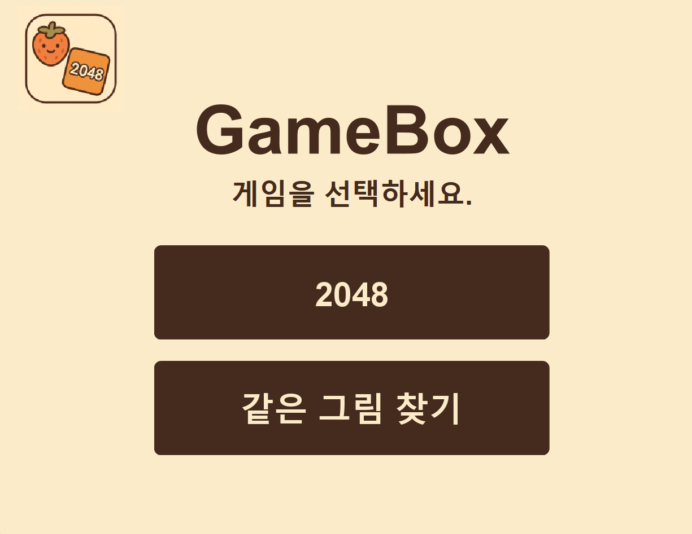
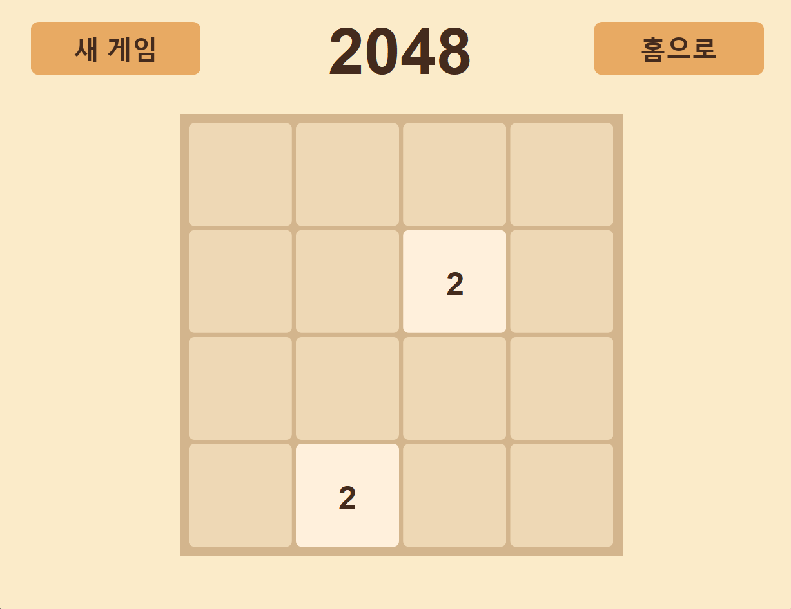
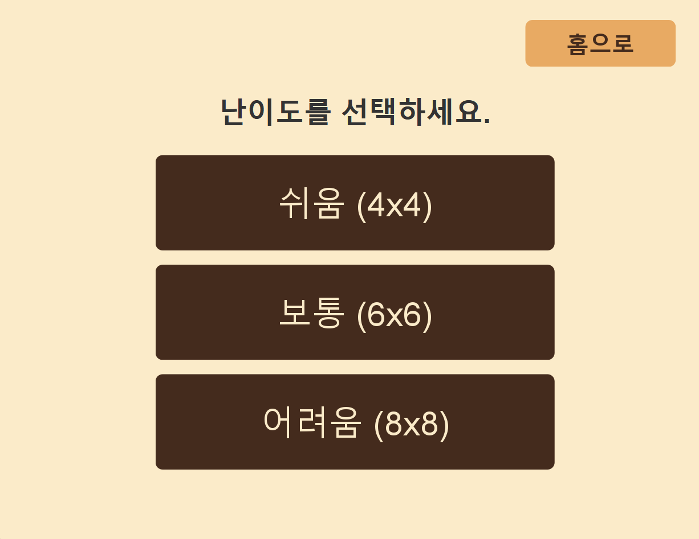
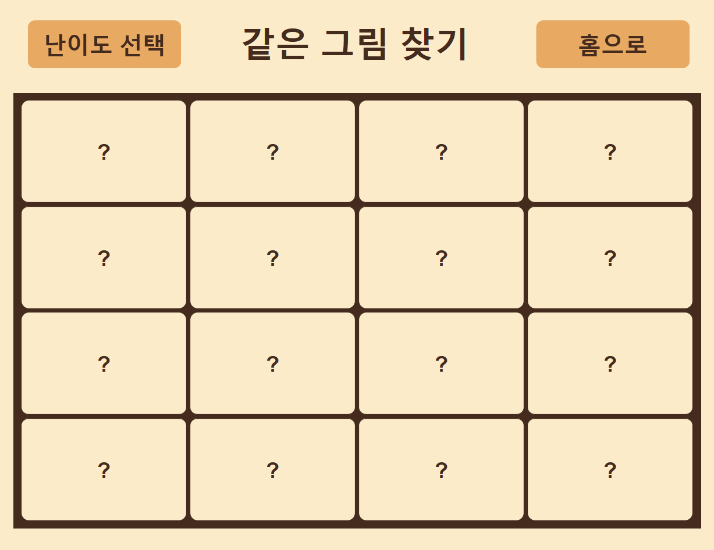
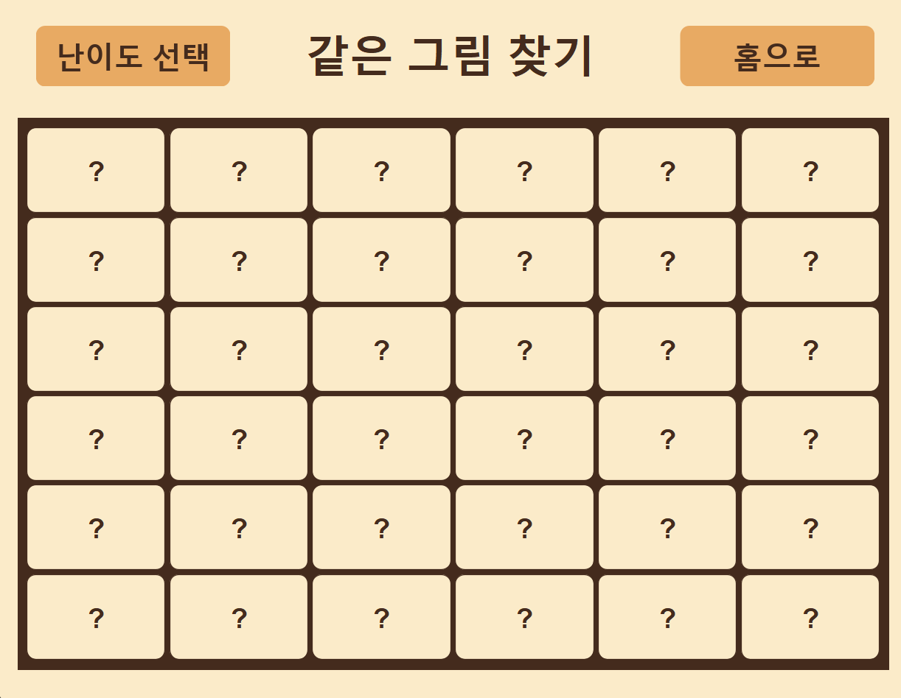
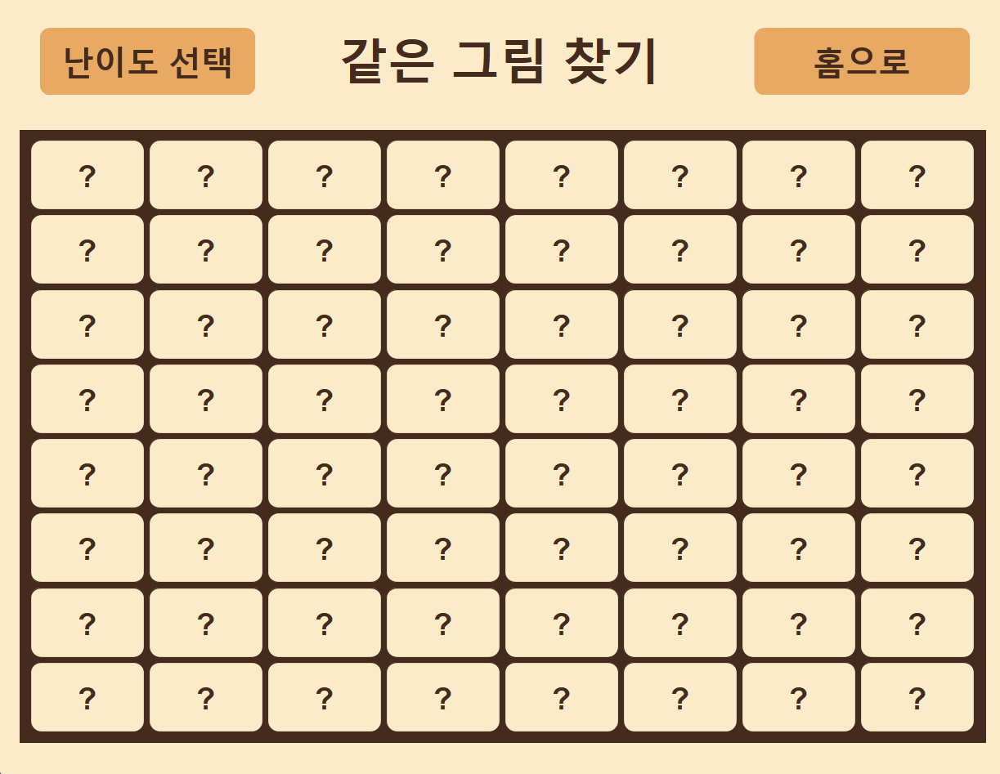

# 🎮 GAMEBOX – GUI 기반 종합 게임 플랫폼

## 📌프로젝트 개요

본 프로젝트는 **GUI 환경(Swing)에서 동작하는 종합 게임 플랫폼**을 제작하는 협업 프로젝트입니다.

2개의 게임과 Swing을 주제로, 팀원들이 **브랜치를 순환하며 매일 다른 게임을 개발**하는 방식으로 진행됩니다.

각자가 작성한 코드를 다른 팀원이 이어받아 개선하고 확장하면서, **코드 가독성, 구조적 설계, 협업 커뮤니케이션 능력**을 함께 향상시키는 것을 목표로 합니다.

### 🎯 목표

- **Git 협업과 브랜치 전략 실습**
- **객체지향 설계 기반의 콘솔 게임 구현**
- **문서화를 통한 협업 프로세스 정립**
- **완성도 높은 미션 결과물 도출**

---


## 🕹️ 기능 소개

>세부 기능 및 구현 내용 👉 [Swing README](https://github.com/wooteco-openmission-8/java-gamebox-8/tree/feature/swing)

### 📌 메인 화면


> **메인 화면에서 두 가지 게임 중 하나를 선택할 수 있습니다.**

<br>

### 📌 2048 게임 화면


> **2048 게임을 플레이하는 화면입니다.**
> 
> 세부 기능 및 구현 내용 👉 [2048 README](https://github.com/wooteco-openmission-8/java-gamebox-8/tree/feature/2048)
- 키보드를 사용해 동일한 숫자 타일을 합쳐 더 큰 숫자를 만드는 게임입니다.
- **새 게임 버튼** - 현재 보드를 초기화하고 새로 시작합니다.
- **홈으로 버튼** - 메인 화면으로 이동합니다.

<br>

### 📌 같은 그림 찾기


> **같은 그림 찾기 세 가지 난이도 중 하나를 선택할 수 있습니다.**
> 
> 세부 기능 및 구현 내용 👉 [같은그림찾기 README](https://github.com/wooteco-openmission-8/java-gamebox-8/tree/feature/samepic)
- 난이도에 따라 카드 개수와 보드 크기가 달라집니다.
<br>
<br>
<p align="center">
  
  
  
</p>

> **같은 그림 찾기 쉬움/보통/어려움 난이도의 게임 화면입니다.**
- 클릭하여 뒤집고, 같은 카드 2장을 맞추면 제거됩니다.

<br>

### 🎬 플레이 gif


## ⚡ 실행 방법 (How to run)

// TODO : 실행방법 추가

[macOS](https://github.com/wooteco-openmission-8/java-gamebox-8/releases/download/v-1.0.0-macOS/GameBox-1.0.0.dmg)

[windows](https://github.com/wooteco-openmission-8/java-gamebox-8/releases/download/v1.0.0-windows/GameBox.zip)

## 👥 협업 방식

- **프리코스 경험을 기반**으로 각 게임을 설계하고 구현합니다.
- 총 2개의 게임과 Swing을 주제로,**팀원들이 하루 단위로 브랜치를 순환하며** 서로의 코드를 이어받아 개발합니다.
- 매일 20시에 스크럼을 진행합니다.

  - 스크럼 이전까지 개발 완료
  - 완료되지 않은 부분도 PR로 제출
  - 스크럼 이후에는 코드 리뷰 진행
- 매일 이전 개발자의 코드를 **PR 기반으로 리뷰 및 개선**하며, 코드 품질과 협업 능력을 함께 향상시키는 것을 목표로 합니다.
- 협업 과정에서는 **PR 리뷰, 브랜치 전략, 커밋 컨벤션 준수**를 원칙으로 합니다.


### 🌿 브랜치 전략

```java
main
├── feature/2048        // 2048 기능 구현
├── feature/samepic     // 같은 그림 찾기 기능 구현
└── feature/swing       // GUI(Swing) 관련 기능 구현
```

- `main`: 전체 프로젝트 구조, 공용 문서 및 공통 클래스 관리
- `feature/game{1,2}`: 각 게임별 로직 구현
- `feature/swing`: Swing을 활용한 GUI 기능 구현
- `feature/{feature-name}/{developer-name}`: 기능별 구현

### 📝 진행 절차

1. `main` 브랜치를 기반으로 프로젝트를 초기 세팅합니다.
2. 각 게임별로 `feature/{feature-name}` 브랜치를 생성합니다.
3. 첫 번째 개발자는 `feature/{feature-name}/{developer-name}` 브랜치를 생성하고 1일차 개발을 진행한 뒤 PR을 생성합니다.
4. 다음 개발자는 이전 개발자가 남긴 PR을 기반으로
    - 코드 리뷰 작성
    - 피드백 반영 및 기능 추가
    - README의 진행 상황 업데이트를 수행합니다.
5. 모든 개발자가 릴레이를 완료하면 PR을 `feature/{feature-name}`으로 병합합니다.
6. 각 기능 개발이 완료되면 `main`으로 병합합니다.


### 📅 개발 일정

| 단계          | 기간                      | 주요 내용                               |
| ----------- | ----------------------- | ----------------------------------- |
| 프로젝트 세팅     | 11.06 ~ 11.07           | 킥오프 미팅, 브랜치 전략 수립, 컨벤션 정의, 초기 구조 세팅 |
| 구현 목록 설계    | 11.08 ~ 11.09           | 기능 구현 목록 정의                         |
| 기능별 개발 완료   | 11.08 ~ 11.15   | 모든 기능 구현 완료                         |
| 테스트 & 리팩토링  | 11.16 ~ 11.17 | 기능 테스트, 버그 수정, 구조 개선, 리팩토링          |
| 문서화 & 최종 점검 | 11.18 ~ 11.25      | 문서화, 통합 검증, 잔여 버그 수정, 안정화           |

---

## 👨‍💻 팀원

<table>
<tr>
<td align="center"></td>
<td align="center"></td>
<td align="center"></td>
</tr>
<tr>
<td align="center"><a href="https://github.com/kimsz123456">김지승</a> <br>BE</td>
<td align="center"><a href="https://github.com/onaflw">최한송</a> <br>BE</td>
<td align="center"><a href="https://github.com/K-KY">김규영</a> <br>BE</td>
</tr>
</table>

---

## ⚙️ 기술 스택

- Language: **Java 21**
- Build Tool: **Gradle**
- Version Control: **Git / GitHub**
- GUI: **Swing**
